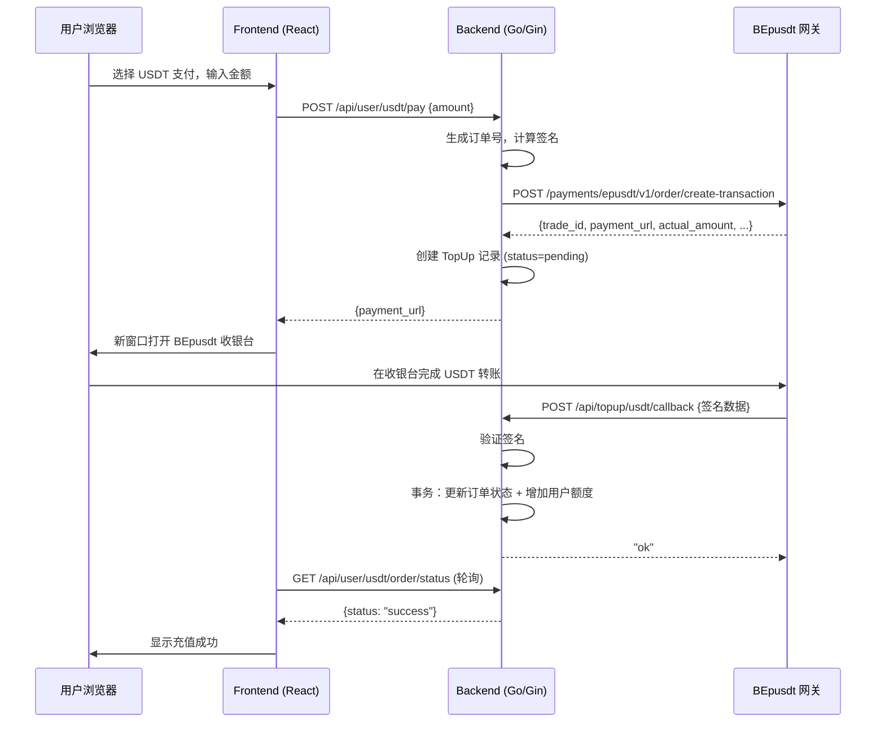

# 技术设计文档：USDT 充值（基于 BEpusdt 支付网关）

## 概述

本设计在现有 new-api 充值系统（已支持易支付、Stripe、Creem、Waffo）基础上，新增 USDT 充值通道。系统通过对接外部 BEpusdt 支付网关实现 USDT 收款，遵循现有的分层架构（Router → Controller → Service → Model）和配置管理模式（setting 包 + options 表）。

核心交互流程：
1. 用户在前端选择 USDT 支付 → 后端调用 BEpusdt API 创建订单 → 返回 payment_url
2. 用户在 BEpusdt 收银台完成支付 → BEpusdt 异步回调通知后端
3. 后端验证签名 → 更新订单状态 → 增加用户额度



## 架构

### 新增/修改文件清单

**后端（Go）：**
- `setting/payment_usdt.go` — USDT 支付配置变量（遵循 `payment_stripe.go` / `payment_waffo.go` 模式）
- `controller/topup_usdt.go` — USDT 充值相关 HTTP handler
- `service/usdt.go` — BEpusdt API 调用、签名计算等业务逻辑
- `model/topup.go` — TopUp 结构体扩展（新增 USDT 相关字段）
- `model/option.go` — InitOptionMap 和 updateOptionMap 中添加 USDT 配置项
- `router/api-router.go` — 注册新路由
- `common/constants.go` — 无需修改（已有 TopUpStatusPending/Success/Failed/Expired）

**前端（React）：**
- `web/src/components/topup/RechargeCard.jsx` — 添加 USDT 支付方式选项
- `web/src/pages/Setting/Payment/SettingsPaymentGatewayUsdt.jsx` — 新增管理员 USDT 配置页面
- `web/src/pages/Setting/Payment/SettingsPaymentGateway.jsx` — 引入 USDT 配置 Tab

### 设计决策

1. **遵循现有支付网关模式**：参照 Waffo 的实现模式（`setting/payment_waffo.go` + `controller/topup_waffo.go`），保持代码风格一致。
2. **配置存储在 options 表**：所有 USDT 配置以 `Usdt` 为前缀存入 options 表，通过 `InitOptionMap` / `updateOptionMap` 同步到内存变量，支持热更新。
3. **复用 TopUp 模型**：在现有 `TopUp` 结构体上扩展字段（trade_id、actual_amount、payment_url 等），而非创建新表，保持充值记录统一管理。
4. **签名逻辑封装在 service 层**：BEpusdt 的签名计算和验证作为纯函数放在 `service/usdt.go`，便于单元测试。
5. **回调接口不需要用户认证**：回调由 BEpusdt 服务器发起，通过签名验证确保安全性，参照 `EpayNotify` / `WaffoWebhook` 模式。

## 组件和接口

### 后端组件

#### 1. `setting/payment_usdt.go` — 配置变量

```go
package setting

var (
    UsdtEnabled        bool
    UsdtApiUrl         string   // BEpusdt API 地址，如 http://your-server:8000
    UsdtApiAuthToken   string   // BEpusdt API 认证令牌
    UsdtCurrency       string   = "cny"   // 法币货币代码
    UsdtNetwork        string   = "tron"  // 区块链网络
    UsdtToken          string   = "usdt"  // 代币符号
    UsdtQuotaPerUnit   float64  = 500000  // USDT 对额度的兑换比率（1 USDT = X quota）
    UsdtMinTopUp       float64  = 10      // 最低充值金额（法币）
    UsdtOrderTimeout   int      = 15      // 订单超时时间（分钟）
)
```

#### 2. `controller/topup_usdt.go` — HTTP Handler

| 函数 | 说明 |
|------|------|
| `RequestUsdtPay(c *gin.Context)` | 用户创建 USDT 充值订单 |
| `UsdtCallback(c *gin.Context)` | 接收 BEpusdt 回调通知 |
| `GetUsdtOrderStatus(c *gin.Context)` | 查询 USDT 订单状态（前端轮询） |

#### 3. `service/usdt.go` — 业务逻辑

| 函数 | 说明 |
|------|------|
| `ComputeBEpusdtSignature(params map[string]string, authToken string) string` | 计算 BEpusdt 签名 |
| `VerifyBEpusdtSignature(params map[string]string, signature string, authToken string) bool` | 验证 BEpusdt 回调签名 |
| `CreateBEpusdtOrder(orderID string, amount float64, notifyURL string, redirectURL string) (*BEpusdtOrderResponse, error)` | 调用 BEpusdt API 创建订单 |
| `CheckBEpusdtOrderStatus(tradeID string) (int, error)` | 查询 BEpusdt 订单状态 |
| `GenerateUsdtOrderID() string` | 生成 USDT 订单号（"usdt-" + 随机字符串，≤32 字符） |
| `StartUsdtOrderExpiryTask()` | 启动订单过期检查定时任务 |

#### 4. 路由注册（`router/api-router.go`）

```go
// 用户认证路由（selfRoute 下）
selfRoute.POST("/usdt/pay", middleware.CriticalRateLimit(), controller.RequestUsdtPay)
selfRoute.GET("/usdt/order/status", controller.GetUsdtOrderStatus)

// 公开回调路由（apiRouter 下，无需认证）
apiRouter.POST("/topup/usdt/callback", middleware.CallbackRateLimit(), controller.UsdtCallback)
```

### 前端组件

#### 1. `RechargeCard.jsx` 修改

在支付方式列表中，当 `enable_usdt_topup` 为 true 时，添加 "USDT (TRC-20)" 选项卡。选择后展示法币金额输入框，提交后在新窗口打开 `payment_url`，同时启动 10 秒间隔的订单状态轮询。

#### 2. `SettingsPaymentGatewayUsdt.jsx` 新增

管理员 USDT 支付配置页面，包含：
- 启用开关（UsdtEnabled）
- BEpusdt API 地址（UsdtApiUrl）
- API 认证令牌（UsdtApiAuthToken）
- 法币货币代码（UsdtCurrency）
- 区块链网络（UsdtNetwork）
- 代币符号（UsdtToken）
- USDT 兑换比率（UsdtQuotaPerUnit）
- 最低充值金额（UsdtMinTopUp）
- 订单超时时间（UsdtOrderTimeout）

遵循 `SettingsPaymentGatewayWaffo.jsx` 的 UI 模式。

## 数据模型

### TopUp 结构体扩展

在现有 `model.TopUp` 结构体上新增以下字段：

```go
type TopUp struct {
    Id               int     `json:"id"`
    UserId           int     `json:"user_id" gorm:"index"`
    Amount           int64   `json:"amount"`           // 法币充值金额（整数，单位由配置决定）
    Money            float64 `json:"money"`             // 实际支付金额
    TradeNo          string  `json:"trade_no" gorm:"unique;type:varchar(255);index"`
    PaymentMethod    string  `json:"payment_method" gorm:"type:varchar(50)"`
    CreateTime       int64   `json:"create_time"`
    CompleteTime     int64   `json:"complete_time"`
    Status           string  `json:"status"`
    // ---- 以下为新增字段 ----
    UsdtTradeId      string  `json:"usdt_trade_id" gorm:"type:varchar(255);index"`      // BEpusdt 平台交易号
    UsdtActualAmount string  `json:"usdt_actual_amount" gorm:"type:varchar(64)"`         // USDT 实际金额
    UsdtAddress      string  `json:"usdt_address" gorm:"type:varchar(255)"`              // 收款地址
    PaymentUrl       string  `json:"payment_url" gorm:"type:text"`                       // BEpusdt 收银台 URL
    ExpirationTime   int64   `json:"expiration_time"`                                     // 订单过期时间戳
}
```

GORM AutoMigrate 会自动为现有表添加新列（`ALTER TABLE top_ups ADD COLUMN ...`），兼容 SQLite/MySQL/PostgreSQL。

### options 表配置项

| Key | 类型 | 默认值 | 说明 |
|-----|------|--------|------|
| `UsdtEnabled` | bool | false | USDT 充值启用开关 |
| `UsdtApiUrl` | string | "" | BEpusdt API 地址 |
| `UsdtApiAuthToken` | string | "" | BEpusdt API 认证令牌 |
| `UsdtCurrency` | string | "cny" | 法币货币代码 |
| `UsdtNetwork` | string | "tron" | 区块链网络 |
| `UsdtToken` | string | "usdt" | 代币符号 |
| `UsdtQuotaPerUnit` | float64 | 500000 | 1 USDT 对应的额度 |
| `UsdtMinTopUp` | float64 | 10 | 最低充值金额（法币） |
| `UsdtOrderTimeout` | int | 15 | 订单超时时间（分钟） |

### API 接口设计

#### POST `/api/user/usdt/pay` — 创建 USDT 充值订单

**认证**：UserAuth

**请求体**：
```json
{
  "amount": 100
}
```

**成功响应**：
```json
{
  "message": "success",
  "data": {
    "payment_url": "https://bepusdt-server/checkout/xxx",
    "trade_no": "usdt-abc123...",
    "usdt_amount": "14.50",
    "expiration_time": 1700000000
  }
}
```

#### GET `/api/user/usdt/order/status?trade_no=xxx` — 查询订单状态

**认证**：UserAuth

**响应**：
```json
{
  "message": "success",
  "data": {
    "status": "pending",
    "trade_no": "usdt-abc123..."
  }
}
```

#### POST `/api/topup/usdt/callback` — BEpusdt 回调

**认证**：无（通过签名验证）

**请求体**（BEpusdt 发送）：
```json
{
  "trade_id": "xxx",
  "order_id": "usdt-abc123...",
  "amount": 100,
  "actual_amount": "14.50",
  "token": "usdt",
  "block_transaction_id": "xxx",
  "status": 2,
  "signature": "md5hash..."
}
```

**成功响应**：纯文本 `ok`

#### GET `/api/user/topup/info` — 充值信息（修改现有接口）

新增返回字段：
```json
{
  "enable_usdt_topup": true,
  "usdt_min_topup": 10,
  "usdt_currency": "cny"
}
```

当 `enable_usdt_topup` 为 true 时，在 `pay_methods` 列表中自动添加：
```json
{
  "name": "USDT (TRC-20)",
  "type": "usdt",
  "color": "rgba(var(--semi-green-5), 1)",
  "min_topup": "10"
}
```

## 正确性属性

*正确性属性是在系统所有有效执行中都应成立的特征或行为——本质上是关于系统应该做什么的形式化陈述。属性是人类可读规范与机器可验证正确性保证之间的桥梁。*

### Property 1: BEpusdt 签名计算与验证的往返一致性

*For any* 非空参数映射（不含 "signature" 键）和任意非空 API_Auth_Token，使用 BEpusdt 签名算法计算出的签名，应当能通过相同算法的验证函数验证通过。即 `VerifyBEpusdtSignature(params, ComputeBEpusdtSignature(params, token), token)` 恒为 true。

**Validates: Requirements 2.6, 3.2**

### Property 2: USDT 订单号格式约束

*For any* 调用 `GenerateUsdtOrderID()` 生成的订单号，该订单号应以 "usdt-" 为前缀，总长度不超过 32 个字符，且仅包含字母、数字和连字符。

**Validates: Requirements 2.1**

### Property 3: 最低充值金额校验

*For any* 充值金额和配置的最低充值金额，当充值金额严格小于最低充值金额时，系统应拒绝创建订单；当充值金额大于等于最低充值金额时，系统应允许创建订单。

**Validates: Requirements 2.4**

### Property 4: 额度计算正确性

*For any* 法币充值金额和配置的 USDT 兑换比率（UsdtQuotaPerUnit），回调处理后用户增加的额度应等于 `amount * UsdtQuotaPerUnit`（使用 decimal 精确计算）。

**Validates: Requirements 3.4**

### Property 5: 回调处理幂等性

*For any* 有效的回调通知（签名正确、status=2、order_id 存在），处理该回调两次后的系统状态（订单状态和用户额度）应与处理一次后的状态完全相同。

**Validates: Requirements 3.5**

### Property 6: 订单过期状态转换

*For any* 状态为 "pending" 的 TopUp_Order，当当前时间超过其 expiration_time 时，过期检查任务应将其状态更新为 "expired"；当当前时间未超过 expiration_time 时，状态应保持 "pending" 不变。

**Validates: Requirements 4.1, 4.2**

### Property 7: BEpusdt API URL 格式验证

*For any* 字符串输入，URL 验证函数应仅接受以 "http://" 或 "https://" 开头的合法 URL 格式，拒绝所有其他格式（空字符串、无协议、ftp://、相对路径等）。

**Validates: Requirements 1.2**

## 错误处理

| 场景 | 处理方式 |
|------|----------|
| BEpusdt API 不可达 | 返回 "充值订单创建失败" 错误，记录错误日志 |
| BEpusdt API 返回错误 | 返回具体错误信息，记录错误日志 |
| 回调签名验证失败 | 返回 HTTP 403，记录安全告警日志（含来源 IP） |
| 回调 order_id 不存在 | 返回 HTTP 200 + "ok"（避免 BEpusdt 重试），记录告警日志 |
| 回调重复处理 | 幂等处理：订单已成功则直接返回 "ok" |
| 订单过期 | 后台任务标记为 "expired"，前端展示过期提示 |
| 管理员配置不完整 | 启用时校验必填项，拒绝保存并提示 |
| 回调 Content-Type 错误 | 返回 HTTP 400 |
| 回调速率超限 | 返回 HTTP 429（由中间件处理） |
| 数据库事务失败 | 事务回滚，返回错误，记录日志 |

## 测试策略

### 属性测试（Property-Based Testing）

使用 Go 的 `testing/quick` 或 `github.com/leanovate/gopter` 库，每个属性测试至少运行 100 次迭代。

| 属性 | 测试文件 | 说明 |
|------|----------|------|
| Property 1: 签名往返 | `service/usdt_test.go` | 生成随机参数 map 和 token，验证 compute→verify 往返 |
| Property 2: 订单号格式 | `service/usdt_test.go` | 多次生成订单号，验证格式约束 |
| Property 3: 最低金额校验 | `service/usdt_test.go` | 生成随机金额和阈值，验证校验逻辑 |
| Property 4: 额度计算 | `service/usdt_test.go` | 生成随机金额和比率，验证计算精度 |
| Property 5: 回调幂等性 | `controller/topup_usdt_test.go` | 模拟重复回调，验证状态和额度不变 |
| Property 6: 订单过期 | `model/topup_test.go` | 生成随机过期时间，验证状态转换 |
| Property 7: URL 验证 | `service/usdt_test.go` | 生成随机字符串，验证 URL 校验 |

标签格式：`// Feature: usdt-recharge, Property {N}: {property_text}`

### 单元测试

- 签名计算的已知向量测试（使用 BEpusdt 文档中的示例数据）
- 回调处理的各种状态码（status=1 待支付、status=2 成功、status=3 过期）
- 配置验证的边界条件（空 URL、空 Token、启用但未配置）
- 订单创建的参数校验

### 集成测试

- 使用 mock HTTP server 模拟 BEpusdt API，测试完整的订单创建→回调→额度增加流程
- 数据库事务测试（并发回调处理、并发补单）
- 路由注册验证
